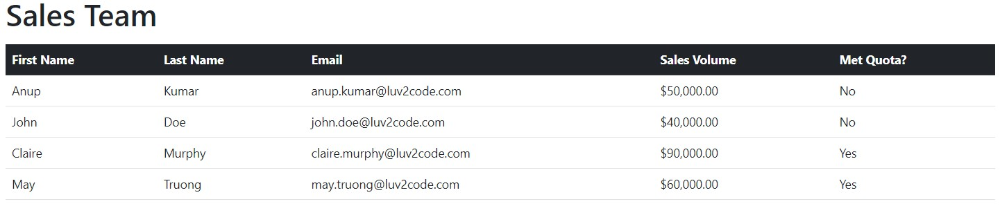

# SalesProject

Второй тренировочный проект: 
- создание класса;
- создание массива экземпляров класса;
- вывод массива в виде html-таблицы с помощью `*ngFor`;
- использование bootstrap-шаблонов;
- ветвление значения ячейки таблицы с помощью `*ngIf`;
- вывод числового значения в денежном формате.

